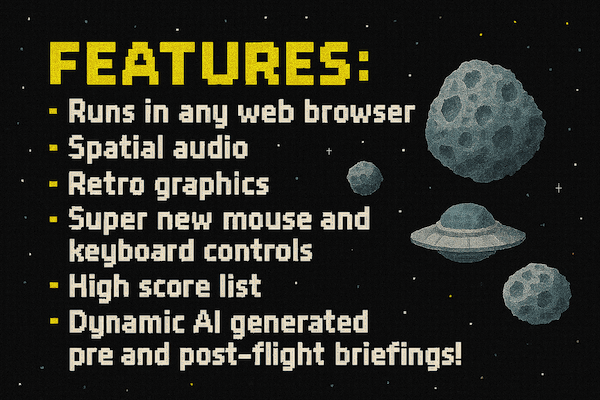

# AI Asteroids
by Rich Lewis


<!-- 

 -->
<!--  -->

<p align="center">
  
  
</p>

<!-- 
  -->

## Description
Fly through space in your web browser, shooting asteroids and bad guys!
A very simple in-browser game. Simple graphics. Simple sound. But cool AI!
All code in the 1 html file.

## Features
- Control your ship using the keyboard or mouse, but in a different way from the traditional "Asteroids" games. Uee the WASD or cursor keys to move the spaceship, and use the mouse to aim the ship's blaster. Press space or left click to shoot where the mouse pointer is aiming. I think this is a better way to control the ship than the old, keyboard-only setup. Do you?
- Crazy simple sound effects, with custom composed explosion sound, etc.
- CRAZY SPACE ACTION!
- Uses GSAP for animation: https://gsap.com/
- Uses Tone library for sounds: https://tonejs.github.io/

## Generative AI features

Dynamic Mission Briefings and After-Action Reports, stories which will be **different** every time!!

**Dynamic Mission Briefings:** Each time you start a new game, a unique mission objective is generated by the Gemini API. You might be tasked with defending a mining colony, escorting a diplomat, or clearing a pirate blockade, adding a new narrative flavor to every session.

**After-Action Reports:** When your game is over, you can now click a new button to have Gemini generate a personalized, heroic "After-Action Report" based on your final score. It's a fun way to commemorate a great run!

Both features include loading indicators while the AI generates the text.

**Uses the Gemini API** for the generative AI stories.

> **Example Mission Briefing:**
> 
>Urgent: The **Xylos Swarm** is assaulting the Jupiter Relay Station! Their bio-weapons will cripple our comms if they succeed. Protect the station at all costs, pilot! Wipe out every last alien before they breach our defenses!

> **Example After-Action Report:**
> 
>  **After-Action Report: Pilot Ensign Kira "Dodger" Bellweather**
>
>  Despite a final score of zero, Ensign Bellweather displayed a truly unparalleled mastery of evasive maneuvers during the recent engagement with the Xylosian raiders. Their craft, "The Indomitable Blip," became an almost mythical target, leading enemy fighters on a wild goose chase through the asteroid field and, according to post-mission comms, narrowly avoiding no fewer than seven head-on collisions with both hostile ships and conveniently placed galactic debris. While no hostile vessels were destroyed by their direct action, Ensign Bellweather's unique talent for *almost* being annihilated undoubtedly diverted a significant amount of enemy ordnance, effectively acting as the galaxy's most resilient, and frankly, luckiest, decoy. A true testament to the principle of "survival through sheer improbability.

---

## Instructions for Setup

Here are the steps to run the full version of the game from GitHub:

  1. Get a **Free API Key:** Go to ): 
  2. **Create Key:** Click the "**Create API key**" button. You may need to sign in with your Google account.
  3. **Copy Key:** A new API key will be generated. **Copy this long string of letters and numbers.**
  4. **Update the Code:** Open the index.html file in a text editor and find this line:

```
const API_KEY = ""; // Leave blank
```
**Paste Your Key:** Paste your copied API key between the quotation marks:

```
const API_KEY = "PASTE_YOUR_API_KEY_HERE";
```
**Save and Run:** Save the file and open it in a web browser. **The mission briefings and after-action reports will now work.**

## Getting Started
```bash
# Clone the repository
git clone https://github.com/RichLewis007/asteroid-blaster.git
cd asteroid-blaster
```

## Usage
SETM.
(Shoot Everything That Moves)

## Changelog
See [CHANGELOG.md](CHANGELOG.md) for version history and release notes.

## Contributing
Pull requests are welcome. For major changes, please open an issue first
to discuss what you would like to change.

## License
This project is licensed under the terms of the MIT license.
